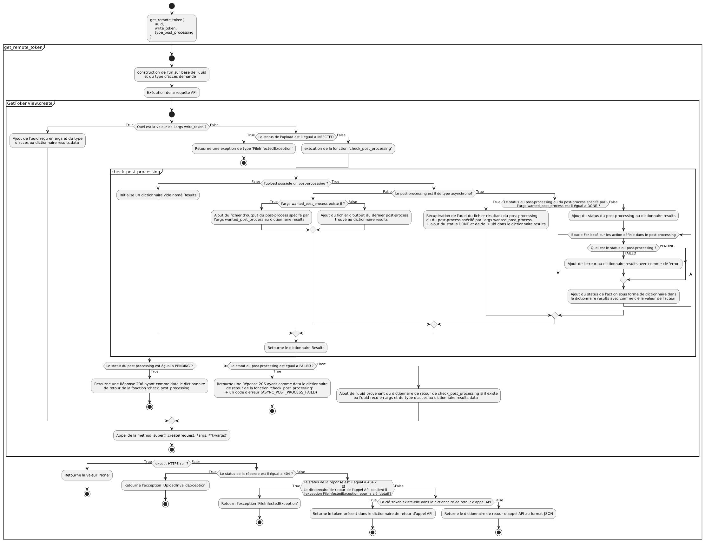

# OSIS Document

`OSIS Document` is a Django application to manage document uploads across OSIS plateform.

# Requirements

`OSIS Document` requires

- Django 3.2+
- Django REST Framework 3.12+
- Requests 2+


# How to install ?

## For production

```bash
# From your osis install, with python environment activated
pip install git+https://github.com/uclouvain/osis-document.git@dev#egg=osis_document
```

## For development

```bash
# From your osis install, with python environment activated
git clone git@github.com:uclouvain/osis-document.git
pip install -e ./osis-document
```

## Configuring OSIS Document

Add `osis_document` to `INSTALLED_APPS` and configure the base url:

```python
import os

INSTALLED_APPS = (
    ...,
    'osis_document',
    ...,
)

# The primary server full url
OSIS_DOCUMENT_BASE_URL = os.environ.get('OSIS_DOCUMENT_BASE_URL', 'https://yourserver.com/osis_document/')
# The shared secret between servers
OSIS_DOCUMENT_API_SHARED_SECRET = os.environ.get('OSIS_DOCUMENT_API_SHARED_SECRET', 'change-this-secret')
# The request upload rate limit for a user, see https://www.django-rest-framework.org/api-guide/throttling/#setting-the-throttling-policy
OSIS_DOCUMENT_UPLOAD_LIMIT = '10/minute'
# A token max age (in seconds) after which it may be no longer be used for viewing/modifying the corresponding upload
OSIS_DOCUMENT_TOKEN_MAX_AGE = 60 * 15
# A temporary upload max age (in seconds) after which it may be deleted by the celery task
OSIS_DOCUMENT_TEMP_UPLOAD_MAX_AGE = 60 * 15
# A deleted upload max age (in seconds) after which it may be deleted by the celery task (default = 15 days)
OSIS_DOCUMENT_DELETED_UPLOAD_MAX_AGE = 60 * 60 * 24 * 15
# Upload max age (in seconds) for export expiration policy (default = 15 days)
OSIS_DOCUMENT_EXPORT_EXPIRATION_POLICY_AGE = 60 * 60 * 24 * 15
# When used on multiple servers, set the domains on which raw files may be displayed (for Content Security Policy)
OSIS_DOCUMENT_DOMAIN_LIST = [
    '127.0.0.1:8001',
]
# To configure which extensions are allowed by default for any upload
OSIS_DOCUMENT_ALLOWED_EXTENSIONS = ['pdf', 'txt', 'docx', 'doc', 'odt', 'png', 'jpg']
# To enabled mimetype validation
ENABLE_MIMETYPE_VALIDATION = True
# To define an upload size limit (in Bytes).
OSIS_DOCUMENT_MAX_UPLOAD_SIZE = 5242880
```

OSIS-Document is aimed at being run on multiple servers, so on your primary server, add it to your `urls.py` 
matching what you set in `settings.OSIS_DOCUMENT_BASE_URL`:

```python
if 'osis_document' in settings.INSTALLED_APPS:
    urlpatterns += (path('osis_document/', include('osis_document.urls')), )
```


# Using OSIS Document

`osis_document` is used to decouple file upload handling and retrieving from Django forms and apps with an accent on user interface.

## Declaring a file field on a model

To declare a file field within a Django model :

```python
from django.db import models
from django.utils.translation import gettext_lazy as _
from osis_document.contrib import FileField

class MyModel(models.Model):
    files = FileField(
        verbose_name=_("ID card"),
        max_size=True,  # To restrict file size
        upload_button_text='',  # To customize dropzone button text
        upload_text='', # To customize dropzone text
        min_files=1,  # To require at least 1 file
        max_files=2,  # To require at most 2 files
        mimetypes=['application/pdf', 'image/png', 'image/jpeg'],
        can_edit_filename=False,  # To prevent filename editing
        automatic_upload=False,  # To force displaying upload button
        upload_to='',  # This attribute provides a way of setting the upload directory
    )
```

This `FileField` model field is associated with the form field `FileUploadField`, which can handle file upload on 
custom forms, even on a secondary server.

```python
from django.forms import forms
from osis_document.contrib import FileUploadField

class MyModelForm(forms.Form):
    files = FileUploadField()

    def save(self):
        uuids = self.fields['files'].persist(self.cleaned_data['files'])
```

Note 1: it is very important to call the persists method on the field upon saving, it returns the uuid of the files (it is your job to store these uuids).

Note 2: you can pick examples of MIME types from [this list](<https://developer.mozilla.org/fr/docs/Web/HTTP/Basics_of_HTTP/MIME_types/Common_types>).


### Specify the upload directory

You can specify the upload directory through the `upload_to` property.

When you use the `FileField` model field, the `upload_to` property can either be a string or a function:
- if it is a string, it is prepended to the file name. It may contain strftime() formatting, which will be replaced by the date/time of the file upload.
- if it is a function, it will be called to obtain the upload path, including the file name. This callable must accept two arguments:
  - the current instance of the model where the file field is defined;
  - the file name that was originally given to the file.

When you use the `FileUploadField` form field, you can specify the `upload_to` property as a string that will be prepended to the file name.
However, if you want to reuse the `upload_to` property defined in the related `FileField` model field, you need to specify the `related_model` property in the `FileUploadField` form field with the three following properties to identify the related model field:
- `field`: the name of the model field;
- `model`: the name of the model containing the previous field;
- `app`: the name of the application containing the previous model.

In addition, if the `upload_to` property is a function based on some instance attributes, you must also:
- add a 4th property to the `related_model` property:
  - `instance_filter_fields`: a list of field names that uniquely identify an instance (such as `["uuid"]`).
- Pass the model instance as a parameter to the `persist` function. The fields specified in the `instance_filter_fields` property must be accessible via this instance.

## Rendering an uploaded file in a template

To work with uploaded files in templates :

```html

<ul>

    
    
    <li>
        <a href="{{ file_url }}">
            {{ metadata.name }} ({{ metadata.mimetype }} - {{ metadata.size|filesizeformat }})
        </a>
    </li>

</ul>
```

See next section on what information is available in the metadata.

## Getting info about an uploaded file

To get raw info or download url given a file token:

```python
from osis_document.api.utils import get_remote_metadata
 
metadata = get_remote_metadata(token)
```

Available metadata info:

- `name`: The name of the file (as set by the uploader)
- `size`: The size of the file in bytes
- `mimetype`: The MIME type as per detected by python-magic
- `uploaded_at`: The datetime the file was uploaded at
- `hash`: The sh256 hash of the file
- `url`: The file url to get the file

## Listening javascript events

Some javascript events are triggered by the `Uploader` component:

- `osisdocument:add` when a file has been uploaded.
- `osisdocument:delete` when a file has been removed.

The triggered event contains the tokens related to the uploader before the action (`event.detail.oldTokens`) and
after it (`event.detail.newTokens`) following this format:
```json
{
  "detail": {
     "oldTokens": {"1": "first_token", "2": "second_token"},
     "newTokens": {"1": "first_token", "2": "second_token", "3": "third_token"}
  }
}
```

Javascript example to listen these events:

```javascript
const uploader = document.getElementsByClassName('osis-document-uploader')[0];

uploader.addEventListener('osisdocument:add', event => {
    console.log('old tokens', event.detail.oldTokens);
    console.log('new tokens', event.detail.newTokens);
}, false);
```

Note that the `Uploader` component has the `osis-document-uploader` class.

## Set a custom validity period for a Token

To generate a token with a validity period other than the default 15 minutes, you must use the "custom_ttl" parameter of one of the get_remote_tokens or get_remote_token functions

This optional parameter only accepts numbers and corresponds to the duration in seconds of the validity period


## Post-processing files

To perform post-processing actions manually on files, use the utility function
`post_process`. This function allows you to convert files, merge files,
or do both at the same time.

To do this, set the `post_process_type` parameter with the appropriate
values from the `PostProcessingType` enumeration and provide the uuids of
the files.


```python
from osis_document.utils import post_process
from osis_document.enums import PostProcessingType, PageFormatEnums

post_process(uuid_list=[],
             post_process_actions=[PostProcessingType.CONVERT.name, PostProcessingType.MERGE.name],
             post_process_params={
                 PostProcessingType.CONVERT.name: {'output_filename': 'conversion_file_name'},
                 PostProcessingType.MERGE.name: {'pages_dimension': PageFormatEnums.A4.name,
                                                 'output_filename': 'merge_file_name'}}
             )
``` 

To define the name(s) of the output file(s) or other parameters for the post-processing, use the
`post_process_params` parameter. If no parameter is required, the right dictionary still be defined according to the following format:
```python
post_process_params={
  PostProcessingType.ACTION1.name:{},
  PostProcessingType.ACTION2.name:{},
  ...
}
```
The post-processing output dictionary matches the following tamplate
```python
output={
  'convert': {
    'input':[object_uuid, ...],
    'output':[upload_object_uuid, ...]
  },
  'merge': {
    'input':[object_uuid, ...],
    'output':[upload_object_uuid]
  }
}
```
### File format conversion

To use the file conversion LibreOffice must be installed on the computer.

Allowed Format :
- `Docx` 
- `Doc` 
- `Odt` 
- `txt` 
- `JPG` 
- `PNG`
- `PDF`(Accepted but not converted)

```python
from osis_document.contrib.post_processing.converter_registry import converter_registry

output = converter_registry.process(upload_objects_uuid=List[UUID], output_filename='new_filename')
```

### Files merge in PDF

If the files are not in the PDF format the correct conversion must be done before merging.

```python
from osis_document.contrib.post_processing.merger import Merger
from osis_document.contrib.post_processing.post_processing_enums import PageFormatEnums

Merger().process(input_uuid_files=[], filename='new_filename', pages_dimension=PageFormatEnums.A4.name)
``` 

### Define post-processing actions and post-processing type in a FileField of a model
```python
class ModelName(models.Model):
    ...
    model_field_name = FileField(
        ...
        post_processing=[PostProcessingType.CONVERT.name, PostProcessingType.MERGE.name],
        async_post_processing=False,
        post_process_params={
            PostProcessingType.CONVERT.name: {'output_filename': 'convert_filename'},
            PostProcessingType.MERGE.name: {
                'pages_dimension': PageFormatEnums.A4.name,
                'output_filename': 'merge_filename'
            }
        },
        ...
    )
    ...
```

The parameters available for post-processing are :

- `CONVERT`:
  - `output_filename` The name of the output file
- `MERGE`:
  - `pages_dimension` The page size of the output file (A3, A4, A5, etc..)
  - `output_filename` The name of the output file

### Synchronous post-processing


### Asynchronous post-processing


To configure an asynchronous post-processing, you must set `async_post_processing` to `True` in the model's FileField.

When form is submit, an instance of the `PostProcessAsync` model was created with status `PENDING`.
This instance contains all the parameters necessary for the execution of the post-processing and stores the bases inputs. 

No `PostProcessing` instance is created until the execution of the asynchronous post-processing is launched.

One `PostProcessing` instance is created when a post-process action is completed (conversion of 2 file + merge = 3 `PostProcessing` instance)  

A celery task is configured to periodically run asynchronous post-processing with status `PENDING`.

During the asynchronous process, the `PostProcessAsync` instance is updated to keep the inputs/outputs of each post-processing actions.

If an error occurs during the execution of an asynchronous post-processing, the `results` field of `PostProcessAsync`  is updated with the data relating to this error.
The results dictionary will have the following format :

```python
results_exemple = {
    "POST_PROCESSING_ACTION": {
        "status": "DONE",
        "upload_objects": ['UUID', 'UUID', 'UUID'],
        "post_processing_objects": ['UUID', 'UUID', 'UUID']
    },
    "POST_PROCESSING_ACTION": {
        "errors": {
            "params": "args",
            "messages": ["error_message"]
        },
        "status": "FAILED"
    },
    "POST_PROCESSING_ACTION": {
        "status": "PENDING"
    }
}
```
### Get token of a post-processed file
To get the token of one post-processed file, you must use the function `get_remote_token`, or use the function `get_remote_tokens` if you want the token of many files.

Depending on the value of `wanted_post_process`, on the status of an asynchronous post-processing and on the function used, there can be several possibilities.

#### function get_remote_token()
```python
from osis_document.api.utils import get_remote_token

get_remote_token(uuid='UUID', write_token=False, wanted_post_process=None)
```



If the post-process status is `DONE` or if the post-processing done is synchronous, there can be 3 possibilities:
- If `wanted_post_process` == `None` -> Return a token for the output file of the last post_processing's action.
- If `wanted_post_process` == `PostProcessingWanted.ACTION.name` -> Return a token for the output file of the specified post-processing action
- If `wanted_post_process` == `Original` -> Return a token for the base input file

If post-process status is `FAILED`, there can be 3 possibilities:
- If `wanted_post_process` == `None` -> Return HTTP_422 and a dict containing errors from post-processing process
- If `wanted_post_process` == `PostProcessingWanted.ACTION.name` and action's status is `DONE` -> Return a token for the output file of the specified post-processing action
- If `wanted_post_process` == `Original` -> Return a token for the base input file

If post-process status is `PENDING`, there can be 3 possibilities:
- If `wanted_post_process` == `None` -> Return HTTP_206 and an url to get the progress of an asynchronous post-processing
- If `wanted_post_process` == `PostProcessingWanted.ACTION.name` and action's status is `DONE` -> Return a token for the output file of the specified post-processing action
- If `wanted_post_process` == `Original` -> Return a token for the base input file


#### function get_remotes_token()

```python
from osis_document.api.utils import get_remote_tokens

get_remote_tokens(uuids=['UUID', ...], wanted_post_process=None)
```


The returns are of the same type as for the get_remote_token function except that the function will return a list of tokens instead of a single token


## Add a widget to edit a PDF

```html



  



  <link href="" rel="stylesheet" />



  <script type="text/javascript" src=""></script>

```

This editor comes with a few toolbar components, namely:
 - `pagination`
 - `zoom`
 - `comment`
 - `highlight`
 - `rotation`

If you need to disable some, you can specify ``

Along with these options, you can dispatch custom events to control the widget externally:
 - `changeCurrentPage`
 - `rotate`
 - `zoomIn`
 - `zoomOut`
 - `setScale`
 - `setHighlight`
 - `setCommenting`
 - `save`

```js
var element = document.querySelector('.osis-document-editor');
element.dispatchEvent(new CustomEvent('changeCurrentPage', { detail: 2 }));
element.dispatchEvent(new CustomEvent('rotate', { detail: 90 }));
element.dispatchEvent(new CustomEvent('zoomIn'));
element.dispatchEvent(new CustomEvent('setScale', { detail: 'auto' }));
element.dispatchEvent(new CustomEvent('setCommenting', { detail: '#ff0000' }));
element.dispatchEvent(new CustomEvent('save'));

// You can also listen for these events to know the number of pages and when the user scrolls
element.addEventListener('pageChange', ({detail: {pageNumber}}) => {
  console.log(pageNumber);
});
element.addEventListener('numPages', ({detail: {numPages}}) => {
  console.log(numPages);
});
```

## Cropping images before uploading them

You can add `with_cropping=True` to `FileField`, `FileUploadField` or `FileUploadWidget` to add the ability to crop
any image with [Cropper.js](https://fengyuanchen.github.io/cropperjs/) before they are uploaded. You can also pass custom options through the `cropping_options` parameter:
```python
class ModelName(models.Model):
    ...
    model_field_name = FileField(
        ...
        with_cropping=True,
        cropping_options={"aspectRatio": 16 / 9}
        ...
    )
    ...
```

## Automatic file removal

When a document on Django model field is modified, the old one is automatically declared as deleted:

```python
# `document` is saved
instance.file = document
instance.save()

# `new_document` is saved, `document` is declared as deleted and the physical file will be removed.
instance.file = new_document
instance.save()
```

If you need to keep the old document (for example, the document is moved to another field), you can set the `_files_to_keep` attribute on the instance before saving. The documents will not be declared as deleted then:

```python
# document is saved
instance.file = document
instance.another_file = None
instance.save()

# In that case, `document` would be deleted because the value on the `file` attribute changed.
instance.another_file = instance.file
instance.file = None
instance.save()

# To avoid that, we set `_files_to_keep` before saving.
instance.another_file = instance.file
instance.file = None
instance._files_to_keep = instance.file
instance.save()
```

`_files_to_keep` is a list of UUIDs of the Upload instance to keep.

# Contributing to OSIS-Document

## Frontend

To contribute to the frontend part of this module, install `npm` > 6 (included in [nodejs](https://nodejs.org/en/download/)), and run:
```console
cd osis_document
npm clean-install
npm run build
```

Commands available:
 - `npm run build` builds the frontend component to `osis_document/static/osis_document`
 - `npm run watch` builds the frontend component to `osis_document/static/osis_document` and watch for file changes (warning: this not a hot-reload, you have to refresh your page)
 - `npm run storybook` serve user stories page for development
 - `npm run lint` checks Javascript syntax
 - `npm run test` launch tests
 - `npm run coverage` launch tests with coverage

## OpenAPI schema generation

To ease generation, use the provided generator:
```console
./manage.py generateschema --urlconf=osis_document.urls --generator_class osis_document.api.schema.OsisDocumentSchemaGenerator --file osis-document/schema.yml
```

# Communication between servers

To communicate between two servers (e.g., with SDK-based code), requests are sent with the header `X-Api-Key`
containing the shared secret set in the server using the setting `OSIS_DOCUMENT_API_SHARED_SECRET`, so make sure it set. 

# Troubleshooting on Server-Side

## 1) Upload failed because of HTTP_409 - conflict: Mimetype mismatch
If the setting ENABLE_MIMETYPE_VALIDATION = True, the server will ensure that the uploaded file and the extension 
is correct. We use python-magic to ensure this check and python-magic use 'file' unix command. 
Sometimes, the database of 'file' command can be out-of-date and we can have false positive. 
To update the database, you can copy the content of the file osis_document/docs/ressources/magic into /etc/magic
